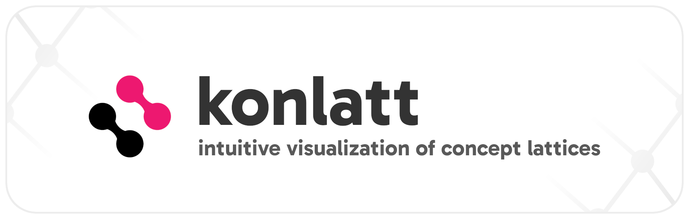
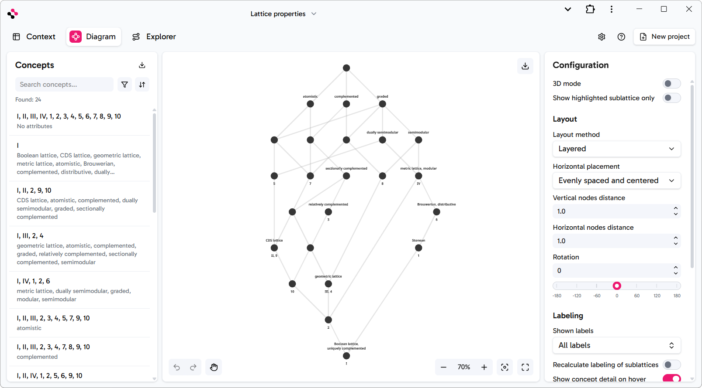
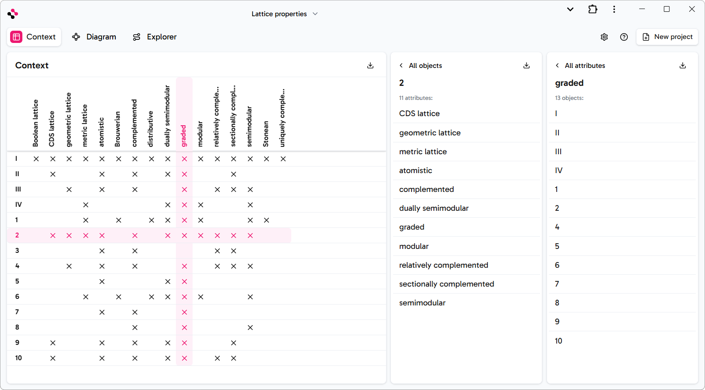
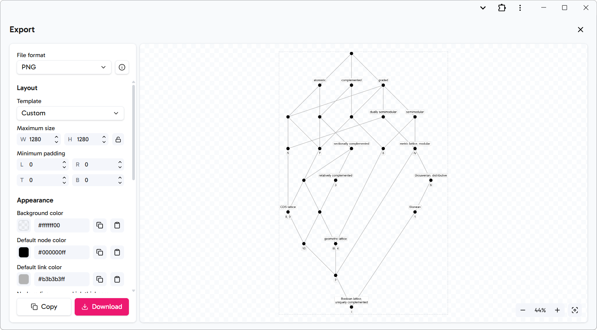
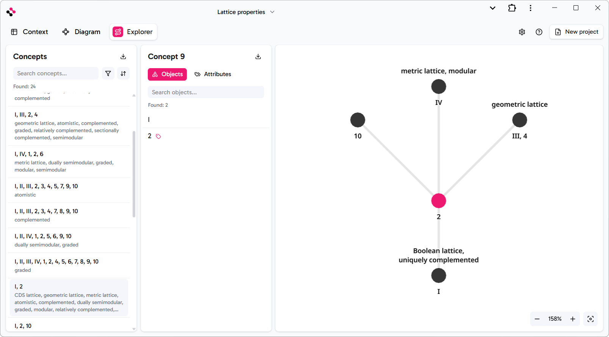

<div align="center">

<p>
<a href="https://radekvym.github.io/konlatt">
    <picture>
        <source srcset="./art/readme/banner_dark.png" media="(prefers-color-scheme: dark)">
        
    </picture>
</a>
</p>

[Open konlatt](https://radekvym.github.io/konlatt) ● [Key Features](#key-features) ● [Tech Stack](#tech-stack) ● [How to Build and Run](#how-to-build-and-run)

<br>

Konlatt bridges the gap between complex Formal Concept Analysis (FCA) and user-friendly interaction, making conceptual data exploration accessible to anyone.

<br>

<p>
<a href="https://radekvym.github.io/konlatt">
    <picture>
        <source srcset="./art/readme/diagram_dark.png" media="(prefers-color-scheme: dark)">
        
    </picture>
</a>
</p>

</div>

> [!NOTE] 
> This application is being developed as part of my master's thesis at [Palacký University Olomouc](https://www.inf.upol.cz/), supervised by [RNDr. Martin Trnečka, Ph.D.](http://trnecka.inf.upol.cz/)

## Key Features

Import formal contexts from various formats and visualize them instantly:

<p>
<picture>
    <source srcset="./art/readme/context_dark.png" media="(prefers-color-scheme: dark)">
    
</picture>
</p>

### Intuitive Visualization

Automatically render formal contexts into clean, readable Hasse diagrams:

<p>
<picture>
    <source srcset="./art/readme/diagram_dark.png" media="(prefers-color-scheme: dark)">
    
</picture>
</p>

* **Layouts**: Choose from **Layered**, or **Force-Directed** algorithms to find the best representation for your data.
* **Manual Layout Control**: Click and drag nodes to fine-tune the visual structure for presentations or clarity.
* **Smart Analysis**: Highlight specific parts of the lattice to uncover hidden dependencies.

### Ready-to-use Exports

Download your finalized lattice directly for research papers or documentation:

<p>
<picture>
    <source srcset="./art/readme/diagram_export_dark.png" media="(prefers-color-scheme: dark)">
    
</picture>
</p>

### Large Lattice Navigation

Navigate complex datasets without visual clutter. Instead of rendering the entire lattice, _Explorer_ mode focuses on local structures:

<p>
<picture>
    <source srcset="./art/readme/explorer_dark.png" media="(prefers-color-scheme: dark)">
    
</picture>
</p>

## Tech Stack

Konlatt leverages a modern web stack to ensure high performance and a seamless user experience without the need for local installations:

- [Vite](https://vite.dev/), TypeScript, C++
- [React](https://react.dev/), [React Router](https://reactrouter.com/), [Zustand](https://zustand-demo.pmnd.rs/)
- [Three.js](https://threejs.org/), [React Three Fiber](https://r3f.docs.pmnd.rs/getting-started/introduction), [Drei](https://drei.docs.pmnd.rs/)
- [Tailwind CSS](https://tailwindcss.com/), [React Icons](https://react-icons.github.io/react-icons/)
- [Eigen](https://libeigen.gitlab.io/)

## How to Build and Run

To run this project, you need to first install the dependencies, then use Docker to compile the C++ code with Emscripten, build the main application, and finally start the development or preview server.

All commands should be run from the project's root directory where `package.json` is located.

### 1. Install Dependencies

First, install the project dependencies:

```bash
npm install
```

### 2. Compile C++ to WASM with Docker

Next, use Docker to compile the C++ code into WebAssembly (WASM) with the Emscripten SDK. Choose the appropriate command for your operating system.

* **Windows:**
    ```bash
    npm run build:emscripten-wins
    ```
* **Unix-like (Linux/macOS):**
    ```bash
    npm run build:emscripten-unix
    ```
* **ARM-based Unix-like (Apple Silicon):**
    ```bash
    npm run build:emscripten-arm-unix
    ```

### 3. Build the Application

After the WASM compilation is complete, build the main application:

```bash
npm run build
```

### 4. Run the Application

Once everything is built, you can preview the application:

```bash
npm run dev # development server
npm run preview # preview server
```
